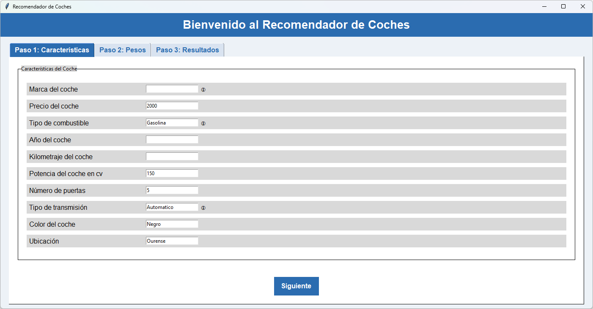
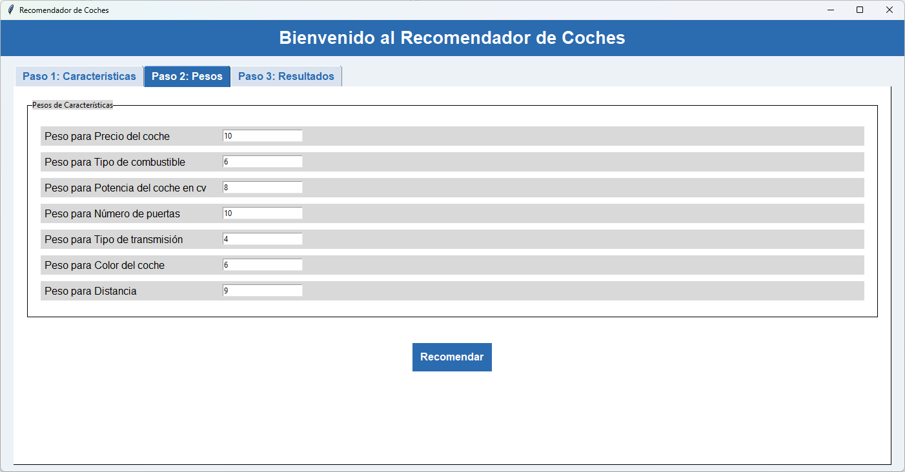
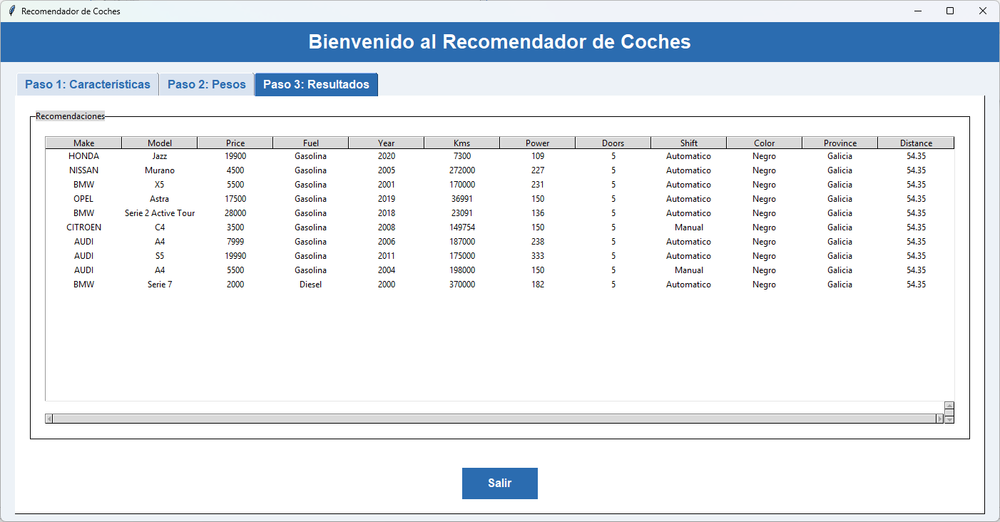

# Sistema de Recomendación de Coches

## Introducción

Elegir el coche ideal puede ser un desafío debido a la gran cantidad de opciones y factores a considerar, como el presupuesto, las características técnicas, la ubicación geográfica y las preferencias personales. Este proceso suele ser largo, frustrante y, a veces, no cumple con las expectativas del comprador.

Para simplificar este proceso, hemos desarrollado un **sistema híbrido de recomendación de coches** que combina técnicas avanzadas como filtrado colaborativo, filtrado basado en contenido y geolocalización. Este programa proporciona recomendaciones personalizadas adaptadas a las preferencias específicas del usuario, como el tipo de combustible, presupuesto y tipo de transmisión. 

Además, hemos diseñado una interfaz intuitiva y accesible que mejora la experiencia del usuario, optimizando la búsqueda y selección de coches. Con esta herramienta, encontrar el coche ideal será más rápido, sencillo y satisfactorio.

# Manual de Instalación y Uso

## Requisitos Previos

### Python
Asegúrate de tener **Python 3** o superior instalado.  
Para verificar la versión instalada, ejecuta:

    python --version  # En Windows
    python3 --version  # En Linux

Si no tienes Python, descárgalo desde [python.org](https://www.python.org/) e instálalo.  
**Nota importante:** Durante la instalación, marca la opción para añadir Python al PATH.

### Pip
Verifica que el gestor de paquetes de Python (pip) esté instalado. Esto generalmente viene incluido con Python.  
Para verificar su instalación, ejecuta:

    pip --version

---

## Pasos de Instalación

1. Clonar el repositorio.

2. Crea un entorno virtual para evitar conflictos con otras bibliotecas de Python.  
   Dependiendo del sistema operativo, utiliza los siguientes comandos:

   **En Windows:**

       python -m venv venv
       venv\Scripts\activate

   **En Linux:**

       python3 -m venv venv
       source venv/bin/activate

3. Con el entorno virtual activado y estando en el directorio del programa, instala las dependencias necesarias con:

       pip install -r requirements.txt

4. **Nota importante sobre la instalación de la librería `Surprise`:**  
   Esta biblioteca requiere que se instale **Microsoft Visual C++ Build Tools** y una versión de `numpy < 2` (ya especificada en `requirements.txt`).  
   Si tienes problemas al instalar `Surprise`, sigue estos pasos:
   - Descarga e instala [Microsoft Visual C++ Build Tools](https://visualstudio.microsoft.com/visual-cpp-build-tools/).
   - Sigue las instrucciones de la página oficial; el proceso es intuitivo.

---

## Manual de Uso

Una vez completada la instalación, puedes ejecutar el programa siguiendo los pasos indicados a continuación.

### Ejecución en Modo Gráfico

1. Ejecuta el programa:

   **En Windows:**

       python car_recommender.py

   **En Linux:**

       python3 car_recommender.py

   Esto abrirá la interfaz gráfica, que es bastante intuitiva.

2. Sigue estos pasos en la interfaz:

   - **Primer paso:**  
     Haz clic en las casillas y escribe las preferencias. Si no sabes qué poner o no deseas incluir algo, puedes dejar casillas en blanco, pero **debes indicar al menos una característica y la ubicación del usuario**.  
     Presiona el botón **"Siguiente"**.

     

   - **Segundo paso:**  
     Introduce un número del 1 al 10 para indicar la importancia de cada característica que seleccionaste en el primer paso.  
     Presiona el botón **"Siguiente"**.

     

   - **Tercer paso:**  
     Presiona el botón **"Recomendar"**. Esto te llevará a la última pestaña con los resultados indicados.  
     Si deseas usar el programa nuevamente, cierra la interfaz, vuelve a ejecutarlo y sigue los mismos pasos.

     

   **Nota:** Si la ubicación ingresada no se encuentra en el caché del programa, este la calculará, lo que puede tardar hasta 30 segundos.

---

### Ejecución en Modo Terminal

Si prefieres usar el programa en la terminal, puedes ejecutarlo de la siguiente manera:

   **En Windows:**

       python car_recommender_cli.py

   **En Linux:**

       python3 car_recommender_cli.py

El funcionamiento es similar al de la versión gráfica: introduce los datos siguiendo la misma lógica.

---

## Notas Finales

- Si encuentras problemas durante la instalación o ejecución, verifica que cumplas con todos los **requisitos previos**.
- Si aún tienes inconvenientes, revisa las dependencias en `requirements.txt` o abre una issue.
